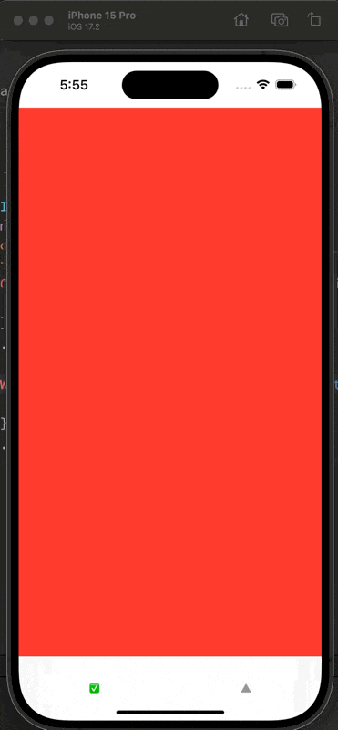

I'm doing some works with TCA + SwiftUIX, I try to make a pagination view with `SwiftUIX's PaginationView` and using `TCA's ForEachStore`. (In TCA 1.7 just a `ForEach`)

## Description

If I using a normal `ForEach` to make views, without scope the TCA store, it work as expected:

```swift
PaginationView(
  axis: .vertical,
  showsIndicators: false
) {
  ForEach(store.pages) { page in
    PageView(
      store: .init(initialState: .init(id: page.id)) {
      Page()
    })
  }
}
```

But doing so, I lose the communicate with child and parent.


---

If using `ForEach` to scope a parent store which TCA sugesstion:

```swift
PaginationView(
  axis: .vertical,
  showsIndicators: false
) {
  ForEach(store.scope(state: \.pages, action: \.pages)) { store in
    PageView(store: store)
  }
}
```

The wrong page size is not as expected.


## Question

In first implement, the [initializer](https://github.com/SwiftUIX/SwiftUIX/blob/8d32dc77c7739c3f5343862c373a8f6d1f60f93c/Sources/SwiftUIX/Intramodular/Pagination/PaginationView.swift#L167) be used. 


https://github.com/SwiftUIX/SwiftUIX/blob/8d32dc77c7739c3f5343862c373a8f6d1f60f93c/Sources/SwiftUIX/Intramodular/Pagination/PaginationView.swift#L167

In second implement, the [initializer](https://github.com/SwiftUIX/SwiftUIX/blob/8d32dc77c7739c3f5343862c373a8f6d1f60f93c/Sources/SwiftUIX/Intramodular/Pagination/PaginationView.swift#L200) be used. 


https://github.com/SwiftUIX/SwiftUIX/blob/8d32dc77c7739c3f5343862c373a8f6d1f60f93c/Sources/SwiftUIX/Intramodular/Pagination/PaginationView.swift#L200

How compiler know which overload shuold be used, and why the `ForEach(store.scope(state: \.pages, action: \.pages))` can't be a first?